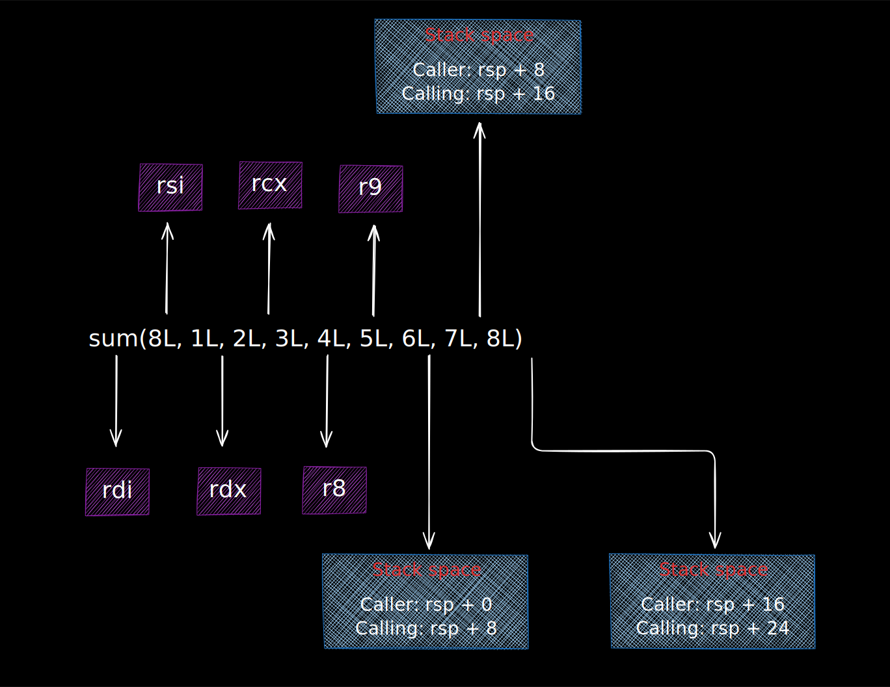
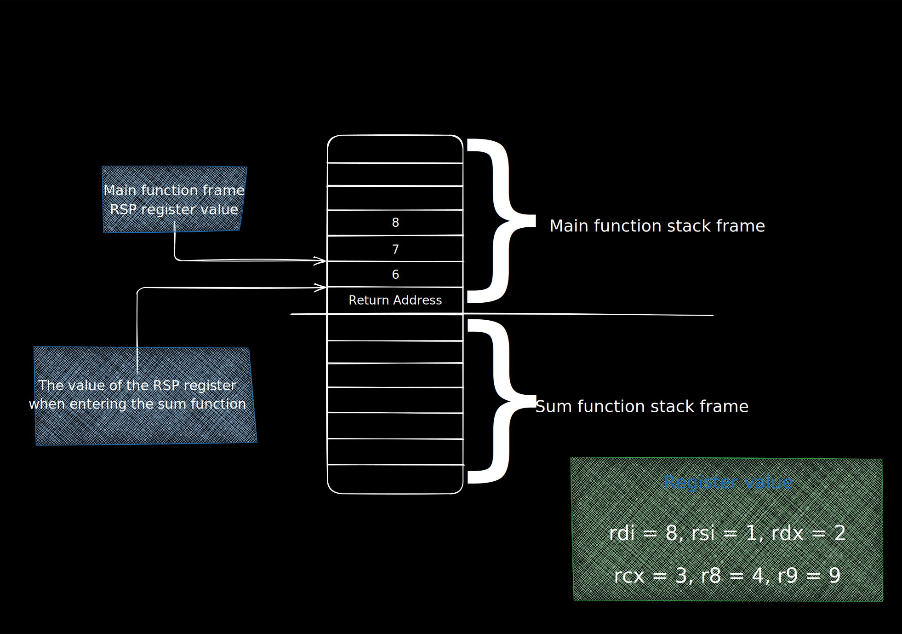
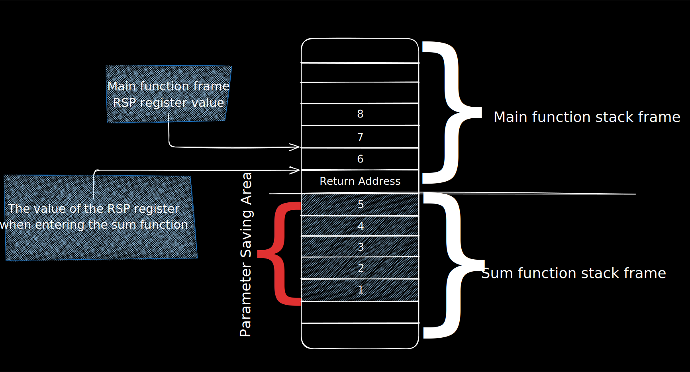
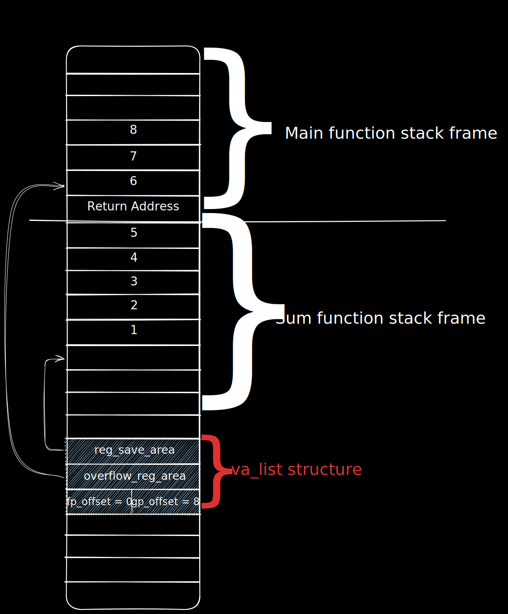
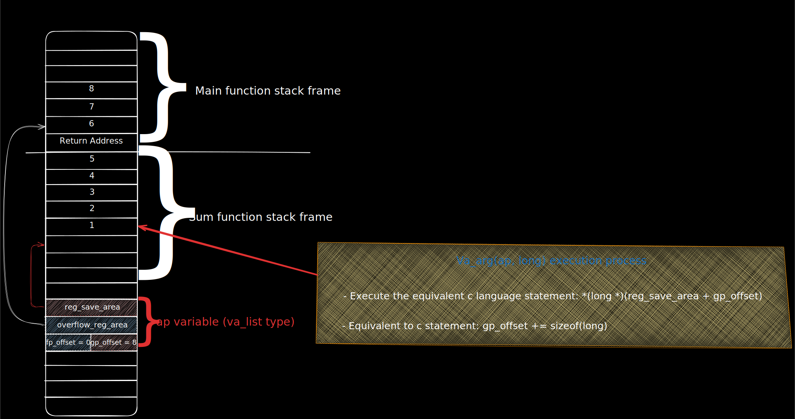
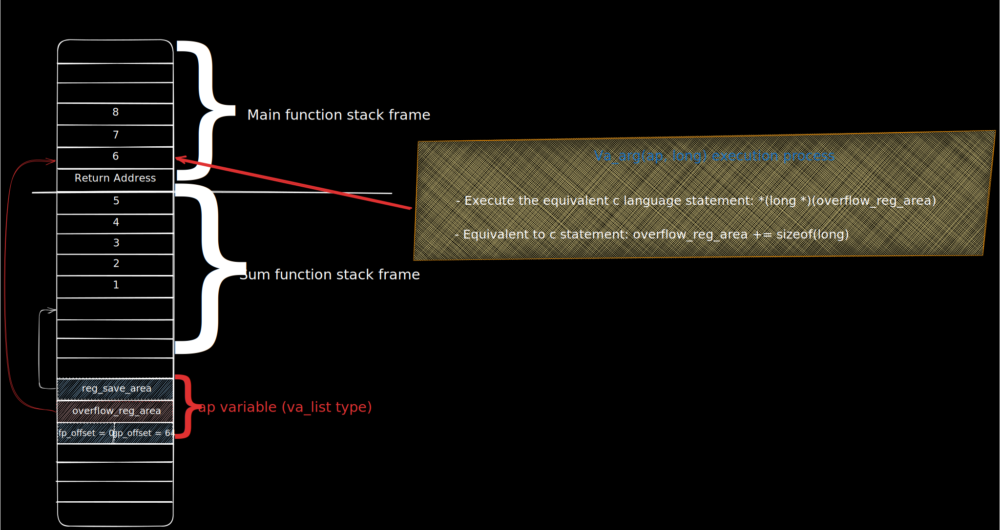

# Variadic Functions
## Start with a sample program
As usual, in order to better illustrate the implementation principle of variable parameters, I will first write a sample program. 
All subsequent analysis will be based on it to facilitate readers' understanding and better understand the essence of the solution.

```c
#include <stdarg.h>
#include <stdio.h>

long sum(long num, ...)
{
        va_list ap;
        long sum = 0;

        va_start(ap, num);

        while(num--) {
                sum += va_arg(ap, long);
        }

        va_end(ap);
        return sum;
}

int main()
{
        long ret;
        ret = sum(8L, 1L, 2L, 3L, 4L, 5L, 6L, 7L, 8L);
        printf("sum(1..8) = %ld\n", ret);

        return 0;
}
```
In order to reduce the noise of the discussion, all function parameters are long, that is, 64-bit integers, and there are no floating-point type parameters. 
If readers don't know much about C language variable parameter functions, you can refer to my article "Intimate Contact with C Variable Parameter Functions". 
This article will no longer explain the definition of C language variable parameter functions themselves, and the semantics of va_start, va_arg and va_end interfaces, 
but focus on explaining the implementation principles of va_start and va_arg under the X86 architecture.

### X86 architecture function calling convention

Back to the above program, the main function calls the sum function, passing a total of 9 long type parameters. In the X86 architecture, function calls are implemented through the call instruction, but how are the function parameters passed? I guess many readers don't understand it well, so here is a brief introduction.

In 64-bit architecture, the first six basic types (long, int, short, char and pointer) are passed through registers, and the seventh parameter is passed through the stack. Passing through registers can reduce stack push and pop overhead and improve performance. Specifically, the first six parameters are passed through registers rdi, rsi, rdx, rcx, r8 and r9 respectively, and the remaining parameters are passed through the caller's rsp + 0, rsp + 8, rsp + 16, ..., rsp + 8*N address space .

Take the above main function calling sum as an example:
```c
ret = sum(8L, 1L, 2L, 3L, 4L, 5L, 6L, 7L, 8L).
```
#### Parameter passing is shown in Figure 1:

||
|:------------------:|
|Figure 1: Parameter passing convention of main calling sum|
---------

In Figure 1, the parameters passed through the stack are marked with two addresses. Caller is the caller, which indicates the address reached by the main function when it is executed, 
while callee is the callee, which is the address seen when the sum function executes the first instruction. Figure 2 shows the stack space structure when entering sum, 
and you can clearly see the stack space structure during the parameter passing stage.

||
|:------------------:|
|Figure 2: Stack layout when entering the sum function|
---------

When the main function executes the call instruction, it pushes the return address onto the stack and decrements the rsp register by 8 bytes. 
Therefore, the rsp value before main executes the call is exactly 8 bytes different from the rsp value when entering sum. This is why the parameter addresses seen by caller and callee in Figure 1 are exactly 8 bytes different.

Figure 2 shows that the last three parameters passed to the sum function are stored in the high address space on top of the return address. 
Each parameter takes up 8 bytes, and the first six parameters are passed through registers. Readers interested in X86 calling conventions can refer to [System_V_AMD64_ABI](https://en.wikipedia.org/wiki/X86_calling_conventions#System_V_AMD64_ABI) Entry.

#### A First Look at the Linux Implementation
We know that the role of va_start is to tell which parameter is the variable parameter. Take the sum function as an example:
```c
va_start(ap, num);
```
This sentence tells us that the variable parameters are after the num parameter, that is, the parameter list described by ap starts from the second parameter. num is the first parameter, which is passed through rdi, so the first time va_arg(ap, long) is executed, the second parameter is obtained, which should be obtained from rsi, and the next time va_arg(ap, long) is called, it should be obtained from rdx... If va_arg(ap, long) is used to obtain the seventh parameter, it should be obtained through rsp + 8.

How about it, simple right!

Stop… stop… stop…

If you think about it for a while, you will find that there are insurmountable technical problems. The first is, how does va_start know which parameter num is? This is indeed a difficult point, because what is passed to va_start is just a variable name. Another problem is, when calling va_arg(ap, long) to get the 7th parameter, has the value of rsp already changed? Is rsp + 8 correct? There is no way to guarantee it.

The i386 architecture does not have this problem because it stipulates that all parameters must be placed on the stack and in order. It does not depend on which parameter num is. Anyway, the address value of the num parameter (that is, &num) plus sizeof(num) is the starting address of the next parameter, which has nothing to do with the esp register.

However, this solution fails under the x86 standard of passing parameters through registers. So, I looked through the definition of Linux's stdarg.h file to see how it is implemented. I found the /usr/lib/gcc/x86_64-linux-gnu/4.6/include/stdarg.h file under Ubuntu 12.04, but found nothing. The following is the implementation of Linux glibc:
```c
#define va_start(v,l)   __builtin_va_start(v,l)
#define va_end(v)       __builtin_va_end(v)
#define va_arg(v,l)     __builtin_va_arg(v,l)
```
The header file uses the built-in __builtin_va_xxx statements provided by gcc to implement the corresponding functions, and the __builtin_ statements are processed by the gcc compiler during the compilation phase. If you want to understand its implementation principle, you must go over the mountain of gcc.

This is all the information on the Internet. The discussion of variable parameter principle stops here. However, this is just the beginning of the principle that I want to discuss with you. The best part is yet to come. Let's start the long march and create the first blog post about the implementation principle of X86 variable parameter function.

Of course, the gcc code is not something I can grasp. Since I can't analyze it forward, I'll do a reverse analysis to explore the deep secrets of gcc.

If you think about it, the semantics of standard libraries are usually defined by the ANSI C standard, and glibc under Linux only needs to comply with the ANSI C standard, but why does gcc need to help with va_start, va_arg, and va_end? There is a reason for this.

The reason is the two technical problems mentioned above. If they are put into the compiler, these two problems are not problems at all. The num parameter is the nth parameter. For the compiler, this is nonsense. When the compiler sees the signature of the sum function, it knows that num is the first parameter. With a little calculation, it knows that when the va_start(ap, num) statement initializes ap, the mark starts taking variable parameters from the second parameter. The compiler can also secretly generate instructions in the function prologue to record the stack parameter area at the high address of the return address (that is, rsp + 8) into the ap variable, so no matter how rsp changes later, there is no need to worry.

Okay, now we are going to start a reverse journey, please fasten your seat belts.

#### Decompiling and cracking the secrets of gcc

Let's compile and link the code first:
```shell
$ gcc -Wall -g -O2  -o va va.c
```
Also, in order to reduce noise, the -O2 optimization option is used. After understanding the whole principle, interested students can analyze it without using the optimization option.

To prevent the program from not meeting expectations, first look at the running results:

```shell
$ ./va
sum(1..8) = 36
```
At first glance, there is no problem. Let's use gdb to decompile the sum function:

```shell
$ gdb -q ./va
Reading symbols from /home/ivan/va...done.
(gdb) disassemble sum
Dump of assembler code for function sum:
   0x0000000000400590 <+0>:     lea    0x8(%rsp),%rax
   0x0000000000400595 <+5>:     mov    %rsi,-0x28(%rsp)
   0x000000000040059a <+10>:    mov    %rdx,-0x20(%rsp)
   0x000000000040059f <+15>:    mov    %rcx,-0x18(%rsp)
   0x00000000004005a4 <+20>:    mov    %r8,-0x10(%rsp)
   0x00000000004005a9 <+25>:    mov    %rax,-0x40(%rsp)
   0x00000000004005ae <+30>:    lea    -0x30(%rsp),%rax
   0x00000000004005b3 <+35>:    mov    %r9,-0x8(%rsp)
   0x00000000004005b8 <+40>:    movl   $0x8,-0x48(%rsp)
   0x00000000004005c0 <+48>:    mov    %rax,-0x38(%rsp)
   0x00000000004005c5 <+53>:    xor    %eax,%eax
   0x00000000004005c7 <+55>:    test   %rdi,%rdi
   0x00000000004005ca <+58>:    je     0x40061d <sum+141>
   0x00000000004005cc <+60>:    sub    $0x1,%rdi
   0x00000000004005d0 <+64>:    mov    -0x38(%rsp),%rsi
   0x00000000004005d5 <+69>:    jmp    0x4005f9 <sum+105>
   0x00000000004005d7 <+71>:    nopw   0x0(%rax,%rax,1)
   0x00000000004005e0 <+80>:    mov    %edx,%ecx
   0x00000000004005e2 <+82>:    sub    $0x1,%rdi
   0x00000000004005e6 <+86>:    add    $0x8,%edx
   0x00000000004005e9 <+89>:    add    %rsi,%rcx
   0x00000000004005ec <+92>:    mov    %edx,-0x48(%rsp)
   0x00000000004005f0 <+96>:    add    (%rcx),%rax
   0x00000000004005f3 <+99>:    cmp    $0xffffffffffffffff,%rdi
   0x00000000004005f7 <+103>:   je     0x40061d <sum+141>
   0x00000000004005f9 <+105>:   mov    -0x48(%rsp),%edx
   0x00000000004005fd <+109>:   cmp    $0x30,%edx
   0x0000000000400600 <+112>:   jb     0x4005e0 <sum+80>
   0x0000000000400602 <+114>:   mov    -0x40(%rsp),%rcx
   0x0000000000400607 <+119>:   sub    $0x1,%rdi
   0x000000000040060b <+123>:   lea    0x8(%rcx),%rdx
   0x000000000040060f <+127>:   mov    %rdx,-0x40(%rsp)
   0x0000000000400614 <+132>:   add    (%rcx),%rax
   0x0000000000400617 <+135>:   cmp    $0xffffffffffffffff,%rdi
   0x000000000040061b <+139>:   jne    0x4005f9 <sum+105>
   0x000000000040061d <+141>:   repz retq
End of assembler dump.
(gdb)
```
So far, everything has been going smoothly. Now comes the brain-burning moment. Are you ready?

## The sum function is broken down into eight parts

Following the sum assembly, we divide the function into multiple stages:

1. First analyze the stack space structure when entering the sum function

2. How to build a stack structure in the function prologue stage

3. How does the va_start statement initialize the ap variable?

4. Finally, let’s analyze how the va_arg function is implemented.

#### Stage 1: Entering the sum function stage

When executing the first instruction of the sum function, the stack structure is shown in Figure 2 and will not be repeated here.

#### Phase 2: Prologue

As mentioned above, the first six parameters are placed in the rdi, rsi, rdx, rcx, r8 and r9 registers. Although the compiler knows that num is the first parameter and is passed through rdi, the remaining variable parameters start from the rsi register. However, in the sum function code, all variable parameters are accessed through va_arg(ap, long). It is also difficult to traverse the rsi, rdx, rcx, r8 and r9 registers. ap must record the current number and make selections through switch...case to achieve the first call to va_arg from rsi, the second call from rdx, ..., and then to r9. The switch...case statement block is itself a lookup table, so can the code table be converted into a data table to make the va_arg implementation code simpler? The answer is yes.

GCC uses a tricky method, which is to push all 6 registers, those registers for passing variable parameters, into the stack space called parameter saving area in the function prologue stage. This space happens to be located at the high address of the sum function frame.

X86 has 6 registers to pass parameters, each register is 8 bytes wide, so the parameter storage area is 48-bit words. Figure 3 shows the stack structure after executing the prologue instruction of the sum function.

||
|:------------------:|
|Figure 3: Stack structure after the sum function prologue instruction is executed|
---------

Although the parameter storage area generated by gcc is 6 register spaces, 48 ​​bytes, there are actually only 5 variable parameters at most, so they are never used up. Each register is pushed to the corresponding position. For the sum function, the first parameter is a fixed parameter, and the next 5 are variable parameters, so the first 8 bytes in the parameter storage area are left blank, and the following are used to save rsi, rdx, rcx, r8 and r9.

After constructing the parameter storage area, it becomes easy to access the variable parameters in sequence.

#### Phase 3: va_start phase
Oh, by the way, what exactly is the va_list type? If you don't understand this structure, you can't get started with the above assembly instructions . OK, with the help of gdb , the problem is easy.
```shell
(gdb) ptype va_list
type = struct __va_list_tag {
    unsigned int gp_offset;
    unsigned int fp_offset;
    void *overflow_arg_area;
    void *reg_save_area;
} [1]
```
The va_list type is not simple. After carefully comparing the decompiled instructions, we find other details about the va_list type, as explained below:

- reg_save_area:

As the name implies, it is a register storage area, which is a pointer to the parameter storage area created by the prologue instruction.

- overflow_arg_area:

As the name implies, it is an area for storing other parameters. It is a pointer pointing to the parameter area passed by the stack.

- gp_offset:

As the name implies, it is a general register offset, which refers to the parameter to be obtained by the next va_arg(ap, xxx) call, the offset in the parameter storage area.

- fp_offset:

As the name implies, it is the floating point register offset. This article does not discuss floating point registers , so this variable is temporarily skipped. Interested readers can think about how it is used.

The semantics of the va_list type is clear, and the process of va_start initializing ap is also clear. Figure 4 shows the stack structure and ap variable value after va_start(ap, num) is executed.

||
|:------------------:|
|Figure 4: Stack structure and ap variable description after va_start(ap, num) is executed|
---------

The only thing that needs to be explained is that the gp_offset value is 8, which means that the next parameter is stored at the address reg_save_area + 8, and it also means that the next parameter to be processed is the second parameter of sum. In fact, the initial value of gp_offset is that the compiler knows that num is the first parameter, so it starts from the second variable parameter and initializes the offset to 8.

#### Phase 4: va_arg phase

After understanding the va_list structure and initialization process, the rest is very simple. Each time va_start(ap, long) is executed, gp_offset is read first, and then the address of gp_offset + reg_save_area is calculated. According to this address, the parameter value can be read from the parameter storage area, and then the value of gp_offset is added by 8 (that is, sizeof(long)) to read the next parameter.

Oh, wait... What if the parameter save area is exhausted? Don't worry, overflow_reg_area is there to help you. With it, you can access the parameters passed through the stack. So how do you know when the parameter save area is exhausted? Don't worry, gp_offset is the gatekeeper. Just ask it and you will know. If its value is greater than 48 (i.e. 6 register bits wide), it means that the reading is exhausted, so start reading from overflow_reg_area.

However, overflow_reg_area has no corresponding offset pointer. Each time after reading, the pointer is directly updated to point to the next parameter. Figure 5 shows the execution process of reading the first variable parameter, while Figure 6 shows the process of reading the stack to pass parameters.
||
|:------------------:|
|Figure 5: va_arg accesses the first variable argument procedure|
---------

||
|:------------------:|
|Figure 6: va_arg access stack parameter passing process|
---------
So far, the key processes of the variable parameter principle have been analyzed. As for the va_end and va_stop principles, no in-depth analysis will be made.

## Summarize

After 10 years, I analyzed the implementation principle of variable parameters in C language again. I felt like I had gone back to the starting point after a long journey. In fact, I have deepened my understanding of the language itself and the compiler. Since I have no experience in reading gcc source code , I did not deeply analyze the source code of the built-in functions __builtin_va_start and __builtin_va_arg provided by gcc, but explored through binary decompilation. I hope that experts with experience in compilers can write a sister article for readers.

Finally, let’s summarize:

1. Once gcc finds that va_start and va_arg are used in a function, it will generate a prologue instruction, create a stack space called the parameter storage area, and save the registers corresponding to the Nth (N < 6) to the 6th parameter in the parameter storage area.

2. The va_list variable structure has two pointers, pointing to the parameter storage area and the stack transfer parameter area respectively. gp_offset and fp_offset respectively store the offset of the next parameter in the parameter storage area. When it exceeds 48, the parameter is accessed through overflow_reg_area

3. va_start initializes va_list, and va_arg accesses the next parameter according to the state of the va_list variable (ap in this program). If gp_offset < 48, it is reg_save_area + gp_offset, otherwise it is overflow_reg_area. After the current access is completed, the value must be updated to point to the next parameter.
